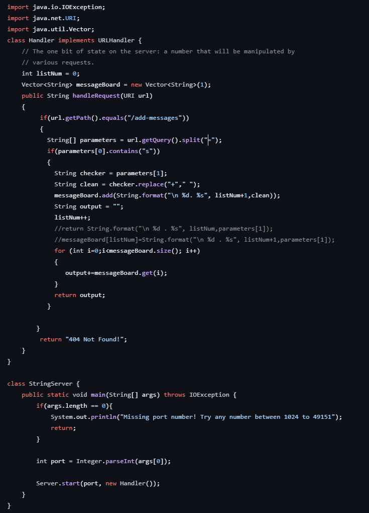
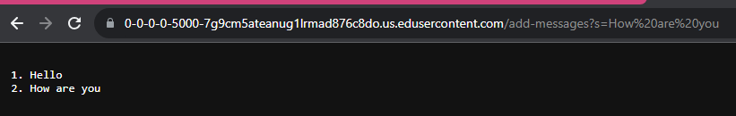
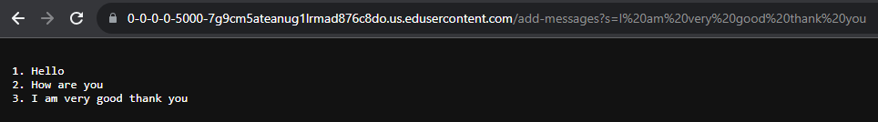

#StringServer Code

#Example 1

My code does not have any methods. My code splits the string after the  `?s`, and then turns everything after the `?s=` into a string. The string is then added to a vector of every string that has been entered. It then outputs every element of the messageBoard vector. The code takes the parameters `listNum`, which is the line counter, and `clean`, which is the cleaned string of the input supplied by the user. These strings inside the vector are then added together into the final string `output`. For this request, `clean` takes the string "I am very good thank you". `clean` is then formatted together with a new line and some formatting, and then added into the `messageBoard` vector. The message counter is then incremented by 1. The output is then finalized inside the string `output`. The for loop goes around, adding each line of the messages into the final `output` string. In this example this would look like `output` =  "1. Hello" then in the next loop it would become `output` =  "1.Hello \n2. How are you"

#Example 2

My code does not have any methods. My code splits the string after the  `?s`, and then turns everything after the `?s=` into a string. The string is then added to a vector of every string that has been entered. It then outputs every element of the messageBoard vector. The code takes the parameters `listNum`, which is the line counter, and `clean`, which is the cleaned string of the input supplied by the user. These strings inside the vector are then added together into the final string `output`. For this request, `clean` takes the string "How are you". `clean` is then formatted together with a new line and some formatting, and then added into the `messageBoard` vector. The message counter is then incremented by 1. The output is then finalized inside the string `output`. The for loop goes around, adding each line of the messages into the final `output` string. In this example this would look like `output` =  "1. Hello\n2. How are you"" then in the next loop it would become `output` =  "1.Hello\n2. How are you\n3. I am very good thank you"

#Part 2
I created my ssh key on the school computer and didn't take a screenshot. I'm gonna ask the professor what to do and I'll get this fixed for the resubmission...

#Part 3
I didn't know how to login to servers. I also didn't know much about java because the ommunity college I transferred from focused on C++. This week has been interesting learning the different syntax between the two languages.
