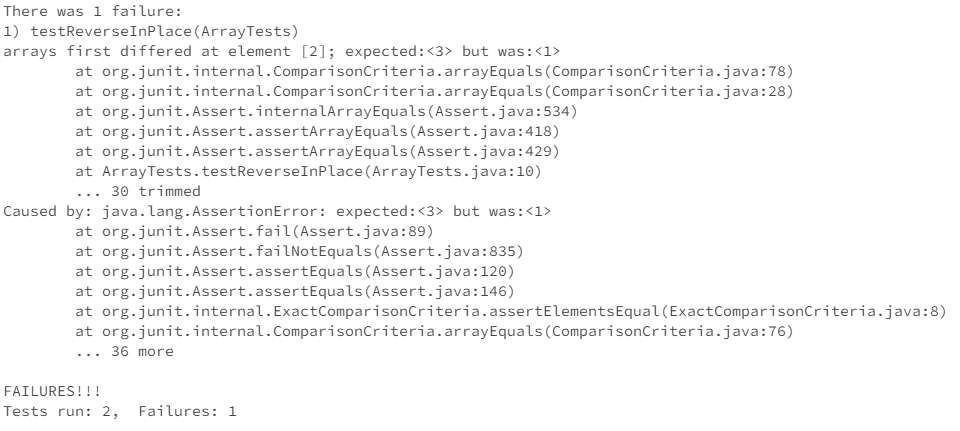

#Part 1
A failure inducing input for the original method reverseInPlace is an array of {3,2,1}. 
`@Test 
	public void testReverseInPlace() {
    int[] input1 = { 3, 2, 1 };
    ArrayExamples.reverseInPlace(input1);
    assertArrayEquals(new int[]{ 1, 2, 3 }, input1);
	}`
 An input that doesn't induce failure would be an array that only contains one object, such as {3}
 `@Test 
	public void testReverseInPlace() {
    int[] input1 = { 3 };
    ArrayExamples.reverseInPlace(input1);
    assertArrayEquals(new int[]{ 3 }, input1);
	}`

`static void reverseInPlace(int[] arr) {
    for(int i = 0; i < arr.length; i += 1) {
      arr[i] = arr[arr.length - i - 1];
    }
  }`

`static void reverseInPlace(int[] arr) {
    int temp = 0;
    for(int i = 0; i < arr.length/2; i += 1) {
      temp = arr[i];
      arr[i] = arr[arr.length - i - 1];
      arr[arr.length - i - 1] = temp;
    }
  }`

  This fix addresses the issue because the bug was that the previous values of the array were not saved. Thus, by making a temporary variable and simulatneously swapping two positions at once, (and halfing the for loop) the bug was solved.

#Part 2
One way to use grep is to pipe information to it using `|`. For example, using `ls |grep chapter-1` in the directory `docsearch/technical/911report` outputs
`chapter-10.txt
chapter-11.txt
chapter-12.txt
chapter-13.1.txt
chapter-13.2.txt
chapter-13.3.txt
chapter-13.4.txt
chapter-13.5.txt
chapter-1.txt`
Another example of this would be `ls |grep 146` on the directory `docsearch/technical/biomed`, which outputs 
`1468-6708-3-10.txt
1468-6708-3-1.txt
1468-6708-3-3.txt
1468-6708-3-4.txt
1468-6708-3-7.txt`
What this does is pipe the output of the ls command into the grep command. This is useful in the case where there are lots of files inside your current directory, but you are searching for some specific files that have a similar name. 

Another way to use grep is the parameter -v. 
For example using  `ls |grep -v chapter-1` outputs 
`chapter-2.txt
chapter-3.txt
chapter-5.txt
chapter-6.txt
chapter-7.txt
chapter-8.txt
chapter-9.txt
preface.txt`
Another example would be `ls |grep -v chapter` outputs 
`preface.txt`
What the -v parameter does is basically say that you want to exclude the files that contain the parameter supplied. So for the first example, it removed all files that contained "chapter-1", which returned the files that did not start with "chapter-1". In the second example, it returned only the files that did not contain "chapter", which was just the `preface.txt` file.

Another way to use grep is using the parameter -c. 
For example using `cat chapter-1.txt |grep -c planes` for the directory `docsearch/technical/911report` outputs 
`16`
Another example of this would be `cat chapter-2.txt |grep -c Bin` which outputs `157`.
What the `-c` parameter does is output the count of only the matching lines that contain the supplied parameter. Thus, for the first example, it displays that "planes" was found in 16 different lines. For the second example, "Bin" was found in 157 different lines. This might be useful in the case where you are trying to find how many different lines mention a given term, so you could search using the `-c` parameter.

Another way to use grep is using the parameter -n. 
For example using `cat chapter-1.txt |grep -n Planes` in the directory `docsearch/technical/911report` outputs
`364:    Boston Center: Planes, as in plural.`
Another example is using `cat chapter-2.txt |grep -n DECLARATION` which outputs `5:            A DECLARATION OF WAR`
The -n parameter outputs the line number of each line that contains the supplied parameter. In the first example, the parameter "Planes" was only found on line 364. In the second example, the parameter "DECLARATION" was only found on line 5. This is useful for if you are trying to search a file for a specific word and to be able to find exactly where inside the file that word can be found. 

One last way to use grep would be using the parameter `-i`
For example, in the directory `docsearch/technical/911report`, using `cat chapter-2.txt |grep -i -c DECLARATION` returns `4`
Similarly, if we use `cat chapter-5.txt |grep -i -c al`, it returns `537`.
The parameter `-i` tells the grep command to ignore the uppercase and lowercase. For example, normally, there is a distinction between "i" and "I", but using the parameter `-i`, there is no distinction. Thus, for the first example, while "DECLARATION" was only present once in the file, as seen in the `-n` example, since we used the `-i` parameter, there was no distinction that the search parameter was in all uppercase. Similarly, in the second example, it returns that there is `537` different word counts for "al". However, if we were to not put the `-i` parameter, it would only return `521`. From this we can see that inside `chapter-5.txt`, there are 16 uses of "al" that uses uppercase and would be excluded without using the `-i` parameter.

All of the parameters that I found for grep were from https://en.wikibooks.org/wiki/Grep. 
