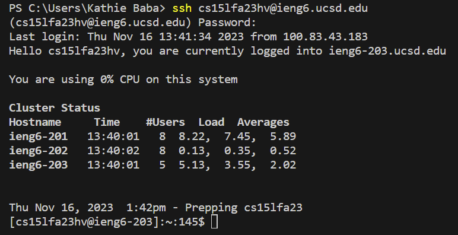
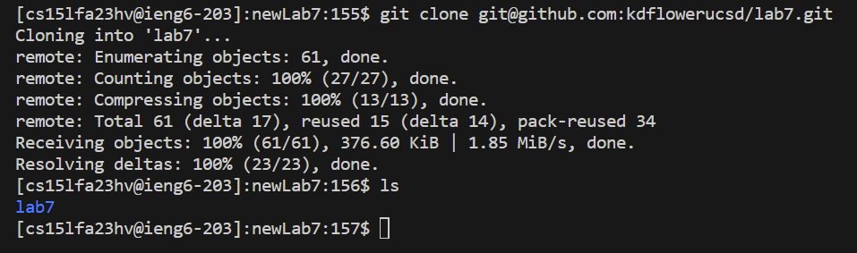
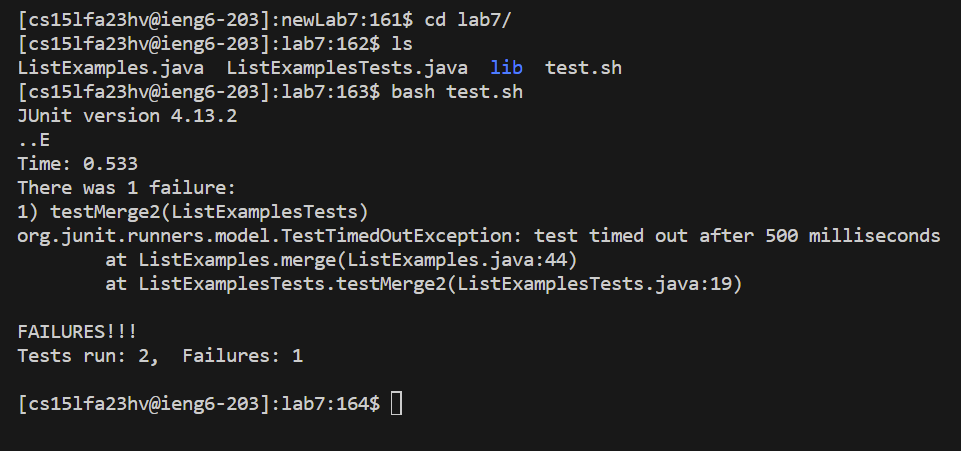
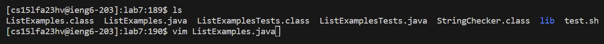
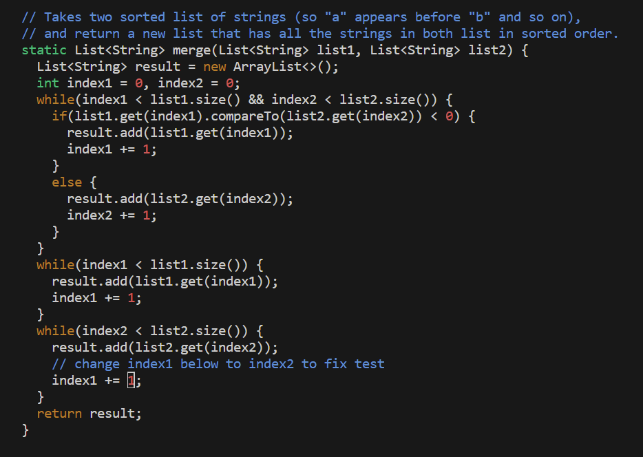
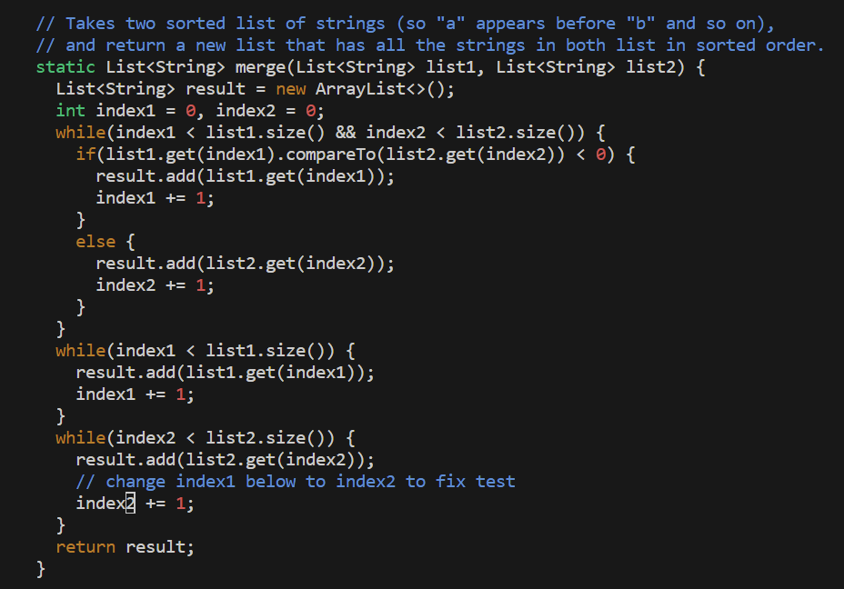
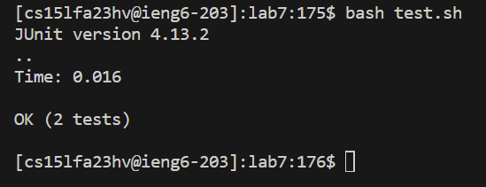
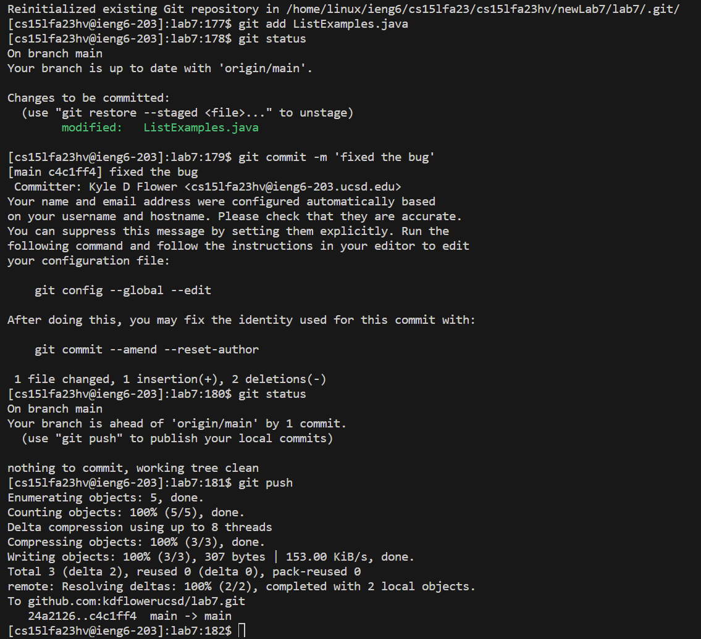

#Lab 4

First to login to ieng6, I used `ssh cs15lfa23hv@ieng6.ucsd.edu` The effect of this command is to remotely login into cs15lfa23hv@ieng6.ucsd.edu. It then prompts me for my password because I haven't setup the ssh key onto the device that I did the assignment on. After entering the password, I press <Enter>, and am logged into ieng6. 

To clone my fork, I used `git clone`, which clones the repository inside the ssh url that I supplied to the command. 

To run the tests, I first `cd` into the `lab7` directory. Then I can use the command `bash test.sh`, which will run the provided bash script that will run the tests. Based on the output, we can see that there is some error with the code that needs to be fixed.

To fix the code, I use `vim ListExamples.java` so that I can remotely edit the file `ListExamples.java`

To quickly move to where the bug is, I used the following keys:
Keys pressed: <4><2><j><1><1><l>
What this does is that 42j moves the cursor down 42 lines, and then 11l moves the cursor 11 characters to the right. 

To fix the bug I used the following keys:
<x><i><2><esc><:><w><q>
<x> deletes the character that the cursor is located on. Then <i> makes you enter insert mode, which allows me to insert characters to edit the file. I then press 2 to fix the bug, and then <esc> which makes vim enter normal mode and stop editing the file. I then use <:><w><q>, which allows me to save the changes that I made, and to exit vim. 

After exiting vim, I then use `bash test.sh` to test the newly fixed code, and as seen by the output, the fixes that I made in the previous step have worked, and we have passed all the test cases. 

Now, to commit and push the changes to github, I will first use `git init`, which will create a new git repository. Then I use `git add ListExamples.java` to add `ListExamples.java` to the stage to later be pushed. I then use `git status` to check that `ListExamples.java` has been added to the stage to be pushed. Next, I use `git commit -m 'fixed the bug'` to add a commit message. Finally, I use `git push` to publish the changes to my github account. 
