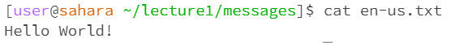

# cd command examples

The working directory was user@sahara. 
I got this output because cd needs an argument because it changes the current directory. No arguments means that there is nothing typed after the command. The output is not an error, because there is no error message, it just doesn't do anything because no location was specified. 

The working directory was /lecture1. I got that output because it changed the working directory, and is letting me know that the current directory has now changed to /lecture1/messages. The output is not an error. 

 
The working directory was /lecture1/messages.  

# ls command examples

The working directory was /home. I got that output because ls lists the contents of the current working directory, which shows that /home contains cse-15l-lab-reports and lecture1. The output is not an error, because it correctly listed the contents. 

The working directory was /home. I got that output because the argument supplied is a directory, so ls listed the files inside the directory lecture1. The output is not an error. 

The working directory was /home/lecture1/messages. I got this output because ls is only able to list the contents of something, hence why it only repeats that it is the en-us.txt file, instead of being able to display the contents of the file. The output is not an error. 

# cat command examples
 
The working directory was /home/lecture1/messages. I got this output because using the cat command with no args makes it wait for the user to input until the control + D key combination is used. The output is not an error. 

The working directory was /home/lecture1. I got this output because cat cannot write the contents of the file to the screen, thus it displays that messages is a directory. This is not an error because it displays that messages is a directory. 

The working directory is /home/lecture1/messages. I got this output because cat writes the contents of the file, and thus "Hello World" is displayed because that is the contents of the en-us.txt file. This is not an error. 

