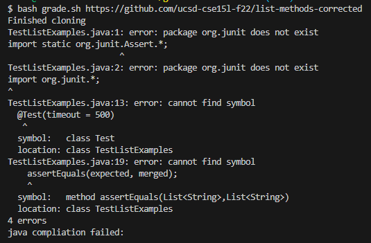
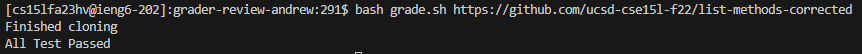

Student:Hi, I was looking for some help fixing this bug I encountered. I tried running the grade bash file, but I kept getting some error that wouldn't let the code run. I read the error, and I think theres something wrong with the JUnit Library
TA: Have you tried running the software on the ieng6 server? Sometimes certain software only works when using the correct operating system.
 It works on the ieng6 server! I looked it up using the advice you gave, and I think the code supplied only works on linux machines. The bug was that the path for the JUnit library is writtten differently for linux compared to windows. Thats why some code that works on the server, which might be running linux, isn't guaranteed to work on a home computer that is running windows.
The file needed for the setup is `grade.sh`, whose directory is `grader-review-andrew/grade.sh`. The relevant contents of the file is `CPATH='.:lib/hamcrest-core-1.3.jar:lib/junit-4.13.2.jar'`. To trigger the bug I ran: `bash grade.sh https://github.com/ucsd-cse15l-f22/list-methods-corrected` on a terminal on a windows OS system,
To fix the bug, one should run the file while on a linux OS system.

From the lab experience, I learned a lot about Java. Prior to this class, I had coded a little in Java, but I had never done as much as what I learned in this class. Another thing that I learned is that you can use the `help` command to learn about a function that you may be unclear how to use, or what it does. I think that this is very useful, and I probably will use it in the future.
